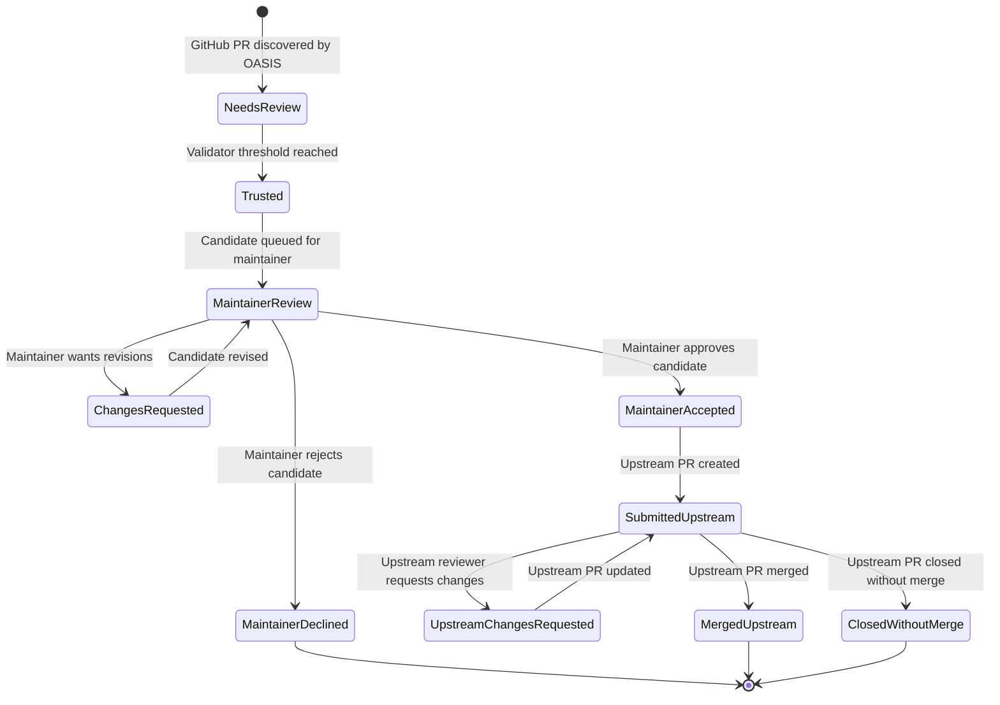

# OASIS Reputation and Recognition System

**Status:** Response-recognition MVP and maintainer/upstream workflow implemented locally
**Initial scope:** First response, fast response, and unattended-request coverage
**Important:** These recognitions do not alter the existing reputation formula, ranks, vote weight, or permissions.

## Product intent

OASIS should recognize people who provide useful and timely human validation without presenting speed as expertise. The system therefore separates:

- **Achievements**, which recognize a specific action such as being first to respond.
- **Activity badges**, which recognize a repeated pattern such as responding promptly or covering neglected work.
- **Trust badges**, which would require stronger quality and outcome evidence and are not part of this MVP.

Recognition must be understandable and based on public OASIS activity. Popularity, employer, sponsorship, and raw comment volume do not determine badge eligibility.

## End-to-end PR lifecycle

The response badges sit inside a larger candidate-fix workflow. Validator votes,
the maintainer decision, and the upstream repository outcome are separate
decision layers.



`Trusted` means that validator consensus has reached the configured threshold.
`Maintainer Accepted` means that the candidate is approved for upstream
submission. `Merged Upstream` means that the upstream repository actually
merged the separate upstream PR. These labels must not be collapsed into one
generic `Accepted` state.

## MVP definitions

### Availability event

OASIS does not yet have an explicit request or assignment workflow. For this MVP, the response clock starts when synchronization first discovers a new open PR and makes it available in the OASIS Workspace.

The event records:

- the PR identifier;
- when the PR became available;
- the source of the event;
- whether the clock is eligible for badges; and
- whether it is open, responded to, closed, or cancelled.

Existing PRs are imported as observation-only because their true OASIS availability time cannot be reconstructed.

### Recognized response

The MVP counts a structured OASIS Accept, Modify, Reject, or Duplicate vote submitted after the availability event. It excludes:

- votes by the PR author;
- votes made before the recorded availability time;
- cancelled or observation-only availability events;
- deleted PRs and PRs classified as duplicates; and
- known automated comments excluded by the existing synchronization pipeline.

The current parser recognizes the OASIS comment format, but the response-badge
MVP does not implement moderation or invalidation. For that reason, the badge UI uses
“recognized OASIS vote,” not “verified expertise” or “quality-qualified review.”

## Maintainer decision layer

The existing `Accept`, `Modify`, and `Reject` chips remain validator decisions.
Maintainers need a separate, role-protected decision in the OASIS UX:

- **Maintainer Review** — awaiting a maintainer decision;
- **Changes Requested** — the candidate has value but needs specific revisions;
- **Maintainer Accepted** — approved for upstream submission; or
- **Maintainer Declined** — rejected before an upstream PR is submitted.

`Changes Requested` is a collaboration state, not a rejection. It must preserve
the maintainer's reason, actor, timestamp, and review history so the contributor
can revise the candidate and return it to Maintainer Review.

Maintainer decisions require server-side authorization, CSRF protection,
idempotency, and an audit record. These controls are implemented in the OASIS
UX. The initial deployment authorizes the existing `admin` role as the
maintainer role; a project-specific maintainer role can be added later without
changing the workflow data model. The maintainer leaderboard remains
informational and does not by itself grant permission to make decisions.

## Upstream submission and outcome

After `Maintainer Accepted`, OASIS creates a separate cross-fork GitHub PR
against the upstream repository from the validated source branch. The original
OASIS PR cannot be retargeted to a different base repository, so OASIS retains a
durable link between the two PRs. A confirmation step is required before the
external GitHub write.

An upstream submission record should retain:

- source OASIS PR;
- upstream repository identity and default branch;
- upstream PR number, URL, and node ID;
- validated head commit SHA and head branch;
- submitting actor and submission time;
- current upstream status and last synchronization time; and
- close reason when the upstream PR closes without merging.

The upstream status should distinguish `Open`, `Changes Requested`, `Merged`,
and `Closed Without Merge`. A closed PR is not automatically a merge rejection:
it may have been withdrawn, superseded, duplicated, or closed by automation.
Use `Maintainer Declined` or `Declined Upstream` only when the evidence supports
that interpretation.

The upstream PR is the source of truth for upstream review and merge outcome.
OASIS refreshes that outcome when the workflow panel is opened and shows it on
the original OASIS PR with
the upstream link, status chip, actor, timestamp, and reason when available.

## MVP recognitions

### First Responder

**Type:** Cumulative achievement

Awarded to the eligible contributor with the earliest recognized response. Equal timestamps are resolved by GitHub comment ID and then login so the result is deterministic.

- One credit per availability event.
- The profile displays the contributor’s cumulative count.
- No reputation or trust effect.

### Fast Responder

**Type:** Current activity badge

Awarded when both conditions are met:

- at least 10 recognized responses in the last 90 days; and
- at least 80% of those responses were submitted within 24 elapsed hours.

The profile shows both criteria independently so a full volume bar cannot hide a missed response-rate threshold.

### Coverage Contributor

**Type:** Current activity badge

Awarded after five first recognized responses in the last 180 days where each request had waited at least 72 elapsed hours.

This balances the incentive to respond quickly by also rewarding people who address unattended work.

## Presentation

Contributor panels include a **Badges** tab. Each card shows:

- what the recognition means;
- earned or not-yet-earned state;
- the measured evidence;
- progress against every criterion; and
- a plain-language explanation of when the clock starts.

The Score tab remains separate. It also explains the existing bonus multiplier, which is unrelated to response badges.

PR-level status chips should expose the candidate lifecycle separately from the
decision chips:

```text
Needs Review → Trusted → Maintainer Review → Maintainer Accepted
                                      ├── Changes Requested
                                      └── Maintainer Declined

Maintainer Accepted → Submitted Upstream → Merged Upstream
                                      └── Closed Without Merge
```

The existing `Accept`, `Modify`, and `Reject` chips continue to represent the
validator's decision on the candidate. They are not replaced by these lifecycle
states.

## Fairness and integrity

- First Responder is intentionally low stakes because request timing favors some schedules and time zones.
- Fast Responder uses a broad 24-hour window rather than ranking people by minutes.
- Coverage Contributor rewards old unattended work.
- Speed never increases vote weight.
- A negative or minority vote is not penalized merely for disagreeing.
- Historical PRs cannot receive invented response clocks.
- Rules and thresholds are centralized and versioned in code.
- Maintainer decisions do not change a validator's response badge or existing reputation score.

## Deferred work

The MVP deliberately defers:

- explicit request assignment and reassignment;
- availability preferences and business-hour clocks;
- persisted provisional, historical, and revoked badge awards;
- moderator invalidation and appeal workflows;
- evidence links for individual qualifying responses;
- Reliable Validator, Maintainer Ally, and Sustained Contributor badges; and
- any connection between badges and workflow permissions.

Those features require separate product decisions, authorization checks, audit records, and privacy review.

## Success measures

During observation, evaluate:

- time to first recognized response;
- percentage answered within 24 and 72 hours;
- age and count of unanswered work;
- response completeness;
- distribution across contributors, projects, and time zones; and
- evidence of rushed or reciprocal behavior.

Raw badge totals are not a success measure by themselves.
