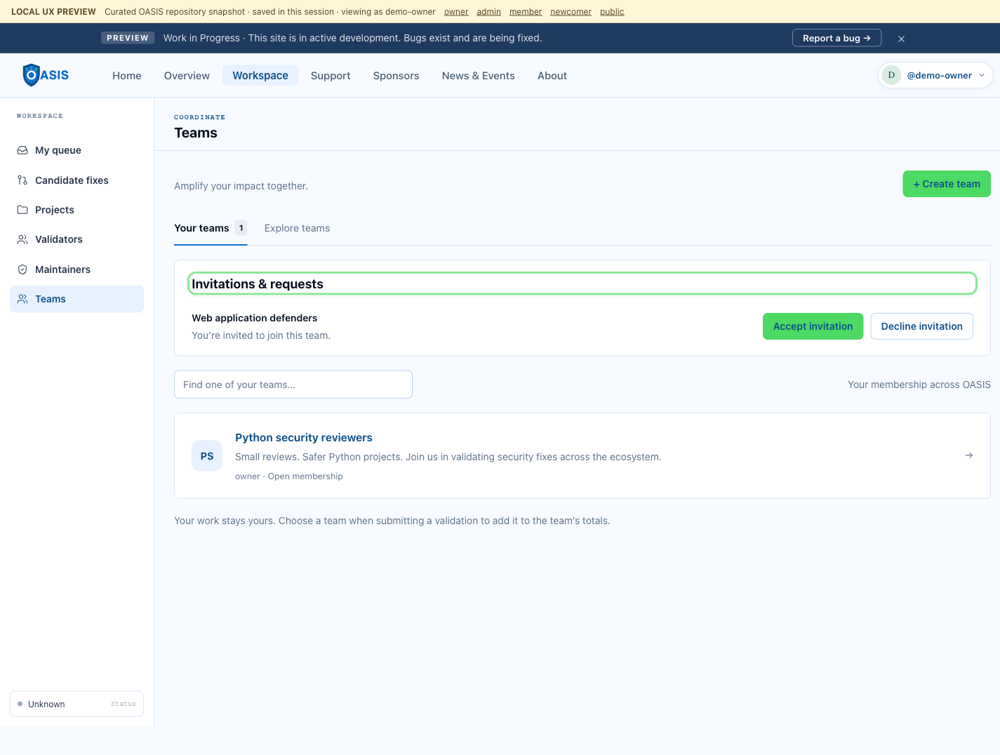
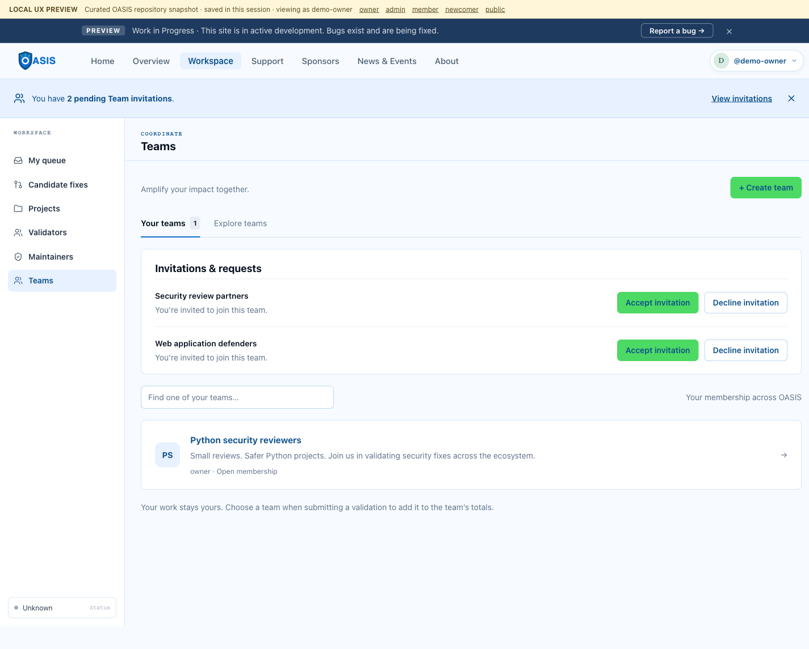
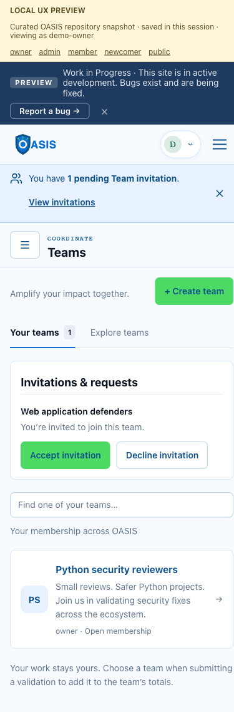

# Team invitation verification

Captured against the local in-memory Teams demo with dummy accounts. No remote
D1, OAuth credentials, deployment, or external messages were used.

## Automated verification

- `npx vitest run tests/worker/integration/teamInvitations.test.ts tests/worker/integration/teams.test.ts`: 22 tests passed.
- `npm run check`: 447 tests across 35 files passed; frontend typecheck, Worker compilation, and Vite production build passed using Node 24.
- `git diff --check`: passed.

## Browser verification

Playwright exercised the built frontend against the real local Worker/D1:

- A pending invitation appears outside the Teams page.
- Dismissal survives reload; the invitation remains accessible in Teams.
- View invitations moves keyboard focus to the inbox heading.
- Multiple invitations produce one notification with the correct plural count.
- Decline changes the count from two to one.
- Accept creates membership and removes the final notification.
- A manager revoking a displayed invitation causes the recipient's response to
  show the unavailable explanation and refresh to the empty state.
- An intercepted 503 invitation read exposes Retry in Teams; retry recovers.
- Signed-out users see no invitation notification.
- Enter activates dismissal; a second tab receives dismissal and retains it on reload.
- Blocked local storage still permits in-memory dismissal without crashing.
- Desktop 1440×1000 and mobile 390×844 render without horizontal overflow.
- The UI re-shows a reminder when given a new session scope (response interception);
  Worker integration tests separately verify that real session creation rotates
  the scope and that this digest cannot authenticate a request.

## Screenshots

Dismissed notification with the invitation still accessible:

Two pending invitations on desktop:

One remaining invitation on mobile after declining the other:

## Observations

The first targeted run caught the existing mine endpoint's missing no-store
header; that was fixed and the focused and full suites then passed. Local
analytics requests return 403 by design in the demo harness. Expected stale
invitation and injected read-failure requests returned 404 and 503 respectively;
there were no JavaScript exceptions from the notification flow. Vite reports its
existing large-chunk warning. Dependency installation reported existing audit
findings; this feature changes no dependencies.

## Required preview follow-up

After human review and merge into `preview`, test a real GitHub logout/login,
cross-tab dismissal, and invitations created/revoked by another account on the
deployed Worker. Local checks do not establish real OAuth or staging results.
No automatic invitation expiry is implemented because the existing model has
no expiration policy. If local storage is blocked, dismissal remains in memory
until reload.
